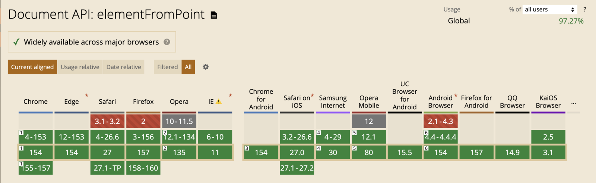

# 用 React 实现批量公司匹配：高亮、连线与虚拟列表联动

## 背景

在 CRM、招投标、供应链和企业数据清洗场景中，经常会收到一批“看起来像公司名称”的文本：

```text
深圳市腾讯计算机系统有限公司
阿里巴巴（中国）有限公司
阿里巴巴
华为科技
字节跳动公司
北京未来星科技有限公司
```

这些数据混合了工商全称、简称、别名、统一社会信用代码和无法识别的名称。只比较字符串是否相等，简称和格式略有差异的名称无法命中；一次性渲染上万条结果，又会让浏览器承担大量没有必要的 DOM 创建、样式计算和布局工作。

本文实现的批量公司匹配 Demo 包含以下能力：

- 批量解析公司名称或统一社会信用代码；
- 左侧展示原始词条，右侧展示去重后的标准企业；
- hover 时高亮左右关联项，并使用 SVG 连线；
- 未匹配企业标红，支持人工选择候选企业；
- 使用虚拟列表处理 1,000 条和 10,000 条测试数据；
- 多个关键词命中同一企业时只渲染一个标准结果；
- 输出去重后的企业名称、地区、信用代码和匹配方式。

## 本文对应的当前代码

Demo 已经按功能拆分，阅读源码时可以从下面几个入口开始：

| 文件 | 先看什么 |
| --- | --- |
| [`CompanyMatchDemo.tsx`](../apps/web/src/pages/demo/company-match/CompanyMatchDemo.tsx) | 页面怎样组合模型、工作区、性能工具条和输出抽屉 |
| [`useCompanyMatchModel.ts`](../apps/web/src/pages/demo/company-match/useCompanyMatchModel.ts) | 输入、匹配、去重、过滤、排序和人工修正怎样形成视图数据 |
| [`useCompanyMatchWorkspace.ts`](../apps/web/src/pages/demo/company-match/useCompanyMatchWorkspace.ts) | 折叠状态、渲染行数和跨列表交互怎样收敛成工作区状态 |
| [`useCompanyMatchInteractions.ts`](../apps/web/src/pages/demo/company-match/useCompanyMatchInteractions.ts) | hover、双向滚动、DOM 登记和 SVG 连线怎样协作 |
| [`CompanyMatchWorkspace.tsx`](../apps/web/src/pages/demo/company-match/CompanyMatchWorkspace.tsx) | 左右面板、匹配按钮和 SVG 图层怎样布局 |
| [`companyMatchViewModel.ts`](../apps/web/src/pages/demo/company-match/companyMatchViewModel.ts) | 输入解析、结果稳定键和来源下标解析 |

页面组件现在只组合页面级模块，工作区视图状态由专门的 hook 管理，左右列表 JSX 也分别进入独立组件。本文前半部分先解释高亮、连线和虚拟滚动背后的原理；第四部分再把这些原理对应到当前 hooks 和组件边界。示例代码均以当前实现为准，而不是假设所有逻辑都写在页面组件中。

## 案例

在设计交互和数据流程前，可以参考这些企业批量查询产品：

- [启信宝批量查询](https://www.qixin.com/batch/search)
- [企查查批量查询](https://www.qcc.com/web/project/batchSearch)
- [企知道企业批量查询](https://qiye.qizhidao.com/batch-query-home)
- [天眼查批量查询](https://www.tianyancha.com/batch)
- [企查猫企业批量查询](https://www.qichamao.com/orgcompany/companybatch)
- ~~[水滴科标](https://kebiao.shuidi.cn/#/)~~
- ~~[爱企查批量查询](https://aiqicha.baidu.com/batchquery)~~
- ~~[企业预警通](https://www.qyyjt.cn/)~~
- ~~[信用视界](https://www.x315.com/)~~
- ~~钉钉企典~~

## 先确定前端关联数据

页面看起来是两个列表，真正贯穿匹配、去重、高亮、滚动和导出的却是两类稳定标识：

- `sourceId`：标识一条原始输入，例如 `source-12`；
- `company.id`：标识企业目录中的标准企业。

逐条匹配结果保存原始词条与标准企业：

```ts
export interface CompanyMatch {
  sourceId: string
  sourceName: string
  company: Company | null
  kind: MatchKind
  strategyLabel: string
  confidence: number
}
```

右侧按 `company.id` 去重以后，一个标准企业可能对应多条输入，因此聚合结果必须继续保存全部来源：

```ts
export interface DeduplicatedCompanyMatch extends CompanyMatch {
  sourceIds: string[]
  sourceNames: string[]
  sourceCount: number
}
```

例如“阿里巴巴（中国）有限公司”和“阿里巴巴”都命中同一家企业时，右侧只渲染一个结果，但它的 `sourceIds` 同时包含两条左侧记录。这个数组是后续所有关联交互的依据，不能在去重时丢弃。

前端不需要了解名称是如何命中的，只需要消费稳定的匹配结果。无论数据来自本地规则、Web Worker 还是服务端接口，只要保留 `sourceId`、标准企业和置信度，后面的高亮、连线与虚拟滚动逻辑都不需要改变。

### 用一个例子贯穿全文

假设左侧有三条输入：

| 左侧下标 | `sourceId` | 输入文本 | 匹配结果 |
| ---: | --- | --- | --- |
| 0 | `source-0` | 阿里巴巴（中国）有限公司 | `company-alibaba` |
| 1 | `source-1` | 阿里巴巴 | `company-alibaba` |
| 2 | `source-2` | 不存在企业 | 未匹配 |

右侧去重后只显示两行：

| 右侧下标 | 结果键 | `sourceIds` |
| ---: | --- | --- |
| 0 | `source-2` | `['source-2']` |
| 1 | `company-alibaba` | `['source-0', 'source-1']` |

后面的交互都在解决同一个问题：已知一侧的稳定 ID，如何找到另一侧的业务记录；目标进入虚拟窗口后，又如何找到它当前对应的 DOM。

这里要区分三层关系：

1. **业务关系**：`sourceId` 对应哪个聚合结果；
2. **虚拟窗口**：目标记录当前是否已经渲染；
3. **几何关系**：两个已渲染元素在页面中的位置。

先解决业务关系，再让目标进入虚拟窗口，最后才能读取 DOM 位置。直接从一个 DOM 猜另一个 DOM，会在排序、去重和虚拟滚动后失效。

## 一、hover 关联高亮如何实现

### 原理：高亮的是业务关系，不是两个 DOM

左侧的“阿里巴巴”与右侧的标准企业不是因为文字相似而高亮，也不是因为它们碰巧都在第 2 行，而是因为右侧结果的 `sourceIds` 包含 `source-1`。

因此交互层只保存一份高亮状态：当前激活了哪些来源 ID。这份状态由
`useCompanyMatchInteractions` 管理，左右面板组件只把它传给对应的行组件。

- hover 左侧 `source-1`：激活 `['source-1']`；
- hover 右侧 `company-alibaba`：激活 `['source-0', 'source-1']`；
- 左侧行判断自己的 ID 是否被激活；
- 右侧行判断自己的 `sourceIds` 是否与激活集合有交集。

```tsx
const [activeSourceIds, setActiveSourceIds] = useState<string[]>([])

const sourceActive = activeSourceIds.includes(sourceId)
const resultActive = result.sourceIds.some((sourceId) =>
  activeSourceIds.includes(sourceId),
)
```

### 从左侧 hover 如何找到右侧元素

这个过程不能一步完成，需要依次经过数据、虚拟列表和 DOM：

1. 左侧事件给出 `sourceId`；
2. 用 `sourceId → resultIndex` 映射找到右侧数据下标；
3. 请求右侧虚拟列表滚动到该下标，确保目标行挂载；
4. 从右侧结果取得稳定键；
5. 用稳定键从 `resultItemRefs` 找到当前 DOM。

先建立来源到结果下标的索引：

```ts
const resultIndexBySourceId = new Map<string, number>()

displayedResults.forEach((result, resultIndex) => {
  result.sourceIds.forEach((sourceId) => {
    resultIndexBySourceId.set(sourceId, resultIndex)
  })
})
```

hover 左侧时，通过索引定位并滚动右侧。当前实现还会同时记录鼠标坐标，供滚动结束后恢复 hover：

```tsx
const handleSourceMouseEnter = useCallback((
  sourceId: string,
  event: ReactMouseEvent<HTMLDivElement>,
) => {
  pointerPositionRef.current = { x: event.clientX, y: event.clientY }
  setHoveredSources([sourceId])

  const resultIndex = resultIndexBySourceId.get(sourceId)
  if (resultIndex !== undefined) {
    syncListToIndex(resultListRef, resultIndex, 'result')
  }
}, [resultIndexBySourceId, setHoveredSources, syncListToIndex])
```

右侧行挂载时，以企业 ID 登记 DOM：

```tsx
const getResultKey = (result: DeduplicatedCompanyMatch) =>
  result.company?.id ?? result.sourceId

const registerResultItem = useCallback((
  result: DeduplicatedCompanyMatch,
  element: HTMLDivElement | null,
) => {
  const resultKey = getResultKey(result)
  if (element) resultItemRefs.current.set(resultKey, element)
  else resultItemRefs.current.delete(resultKey)
}, [])

<ResultListItem
  result={result}
  itemRef={(element) => registerResultItem(result, element)}
/>
```

需要画线时，沿相同路径再次取得右侧记录和 DOM：

```ts
const resultIndex = resultIndexBySourceId.get(sourceId)
const result = resultIndex === undefined
  ? undefined
  : displayedResults[resultIndex]
const resultElement = result
  ? resultItemRefs.current.get(getResultKey(result))
  : undefined
```

如果 `resultElement` 不存在，说明目标尚未进入虚拟窗口，此时不画线。等虚拟列表完成渲染后再测量，不能使用旧 DOM 的坐标。

### 从右侧 hover 如何找到左侧元素

右侧记录已经直接携带 `sourceIds`，因此不需要反查 Map。以示例中的阿里巴巴为例，右侧 hover 会得到 `['source-0', 'source-1']`，左侧两行都应高亮。

```tsx
const handleResultMouseEnter = useCallback((
  result: DeduplicatedCompanyMatch,
  event: ReactMouseEvent<HTMLDivElement>,
) => {
  pointerPositionRef.current = { x: event.clientX, y: event.clientY }
  setHoveredSources(result.sourceIds)

  const sourceId = getNearestSourceId(result)
  const sourceIndex = sourceId ? getSourceIndex(sourceId) : null
  if (sourceIndex !== null) {
    syncListToIndex(sourceListRef, sourceIndex, 'source')
  }
}, [getNearestSourceId, setHoveredSources, syncListToIndex])
```

但虚拟列表可能无法同时显示相距很远的两条来源。用于反向滚动时，应从多个 `sourceIds` 中选择距离当前左侧视口最近的一条；用于高亮和绘线时，则处理当前已经挂载的所有来源 DOM：

```ts
const visibleSourceElements = result.sourceIds.flatMap((sourceId) => {
  const element = sourceItemRefs.current.get(sourceId)
  return element ? [{ sourceId, element }] : []
})
```

### 为什么 state 之外还需要 ref

高亮 class 由 React state 驱动，但 300ms 延迟回调和滚动回调需要读取“执行当下”的最新值。为避免闭包拿到旧 state，同一组 ID 还保存在 ref 中：

```tsx
const [activeSourceIds, setActiveSourceIds] = useState<string[]>([])
const activeSourceIdsRef = useRef<string[]>([])

const setHoveredSources = (sourceIds: string[]) => {
  activeSourceIdsRef.current = sourceIds
  setActiveSourceIds(sourceIds)
}
```

### 滚动后鼠标不动也要重新识别

虚拟滚动会替换鼠标下方的元素，但浏览器不保证重新触发 `mouseenter`。解决方法不是恢复滚动前的 ID，而是记录鼠标坐标，在滚动停止后只在当前组件实例中重新判断“这个坐标下面现在是谁”。

```tsx
const pointerPositionRef = useRef<{ x: number; y: number } | null>(null)
const componentRootRef = useRef<HTMLElement>(null)

const INTERACTIVE_ITEM_SELECTOR = '[data-source-id], [data-result-key]'

function containsViewportPoint(element: HTMLElement, x: number, y: number) {
  const rect = element.getBoundingClientRect()
  return rect.width > 0
    && rect.height > 0
    && x >= rect.left
    && x < rect.right
    && y >= rect.top
    && y < rect.bottom
}

function findInteractiveItemAtPoint(
  componentRoot: HTMLElement,
  x: number,
  y: number,
) {
  const items = componentRoot.querySelectorAll<HTMLElement>(
    INTERACTIVE_ITEM_SELECTOR,
  )
  for (let index = items.length - 1; index >= 0; index -= 1) {
    const item = items.item(index)
    if (containsViewportPoint(item, x, y)) return item
  }
  return null
}

const restoreHoverAtPointer = useCallback(() => {
  const position = pointerPositionRef.current
  const componentRoot = componentRootRef.current
  if (!componentRoot || !position) return

  const pointedElement = findInteractiveItemAtPoint(
    componentRoot,
    position.x,
    position.y,
  )
  if (!pointedElement) return

  const sourceElement = pointedElement?.closest<HTMLElement>('[data-source-id]')
  const sourceId = sourceElement?.dataset.sourceId
  if (sourceId) {
    setHoveredSources([sourceId])
    const resultIndex = resultIndexBySourceId.get(sourceId)
    if (resultIndex !== undefined) {
      syncListToIndex(resultListRef, resultIndex, 'result')
    }
    return
  }

  const resultElement = pointedElement.closest<HTMLElement>('[data-result-key]')
  const resultKey = resultElement?.dataset.resultKey
  const result = resultKey ? resultByKey.get(resultKey) : undefined
  if (!result) return

  setHoveredSources(result.sourceIds)
  const nearestSourceId = getNearestSourceId(result)
  const sourceIndex = nearestSourceId ? getSourceIndex(nearestSourceId) : null
  if (sourceIndex !== null) {
    syncListToIndex(sourceListRef, sourceIndex, 'source')
  }
}, [
  getNearestSourceId,
  resultByKey,
  resultIndexBySourceId,
  setHoveredSources,
  syncListToIndex,
])
```

最上层页面组件负责绑定实例根节点。`workspaceRef` 仍只用于 SVG 坐标换算和尺寸监听，两个 ref 的职责不要混在一起：

```tsx
<section
  ref={workspace.interactions.componentRootRef}
  className="company-match-page"
>
  {/* 当前批量匹配组件的全部内容 */}
</section>
```

#### 为什么不直接使用 `document.elementFromPoint()`

[`Document.elementFromPoint()` 的 MDN 文档](https://developer.mozilla.org/en-US/docs/Web/API/Document/elementFromPoint)将它定义为浏览器的命中测试：传入相对于当前视口左上角的 `x`、`y`，返回这个位置最上层的元素。这里保存的指针事件 `clientX`、`clientY` 与它使用同一个视口坐标系，从坐标语义上看确实可以直接调用。

问题在于 `document` 的搜索范围是整个页面。假设两个 Tab 都挂载了批量匹配组件，全局命中可能先返回另一个实例中的元素；事后再执行 `workspace.contains(pointedElement)` 只能拒绝错误元素，不能继续找到当前实例里的正确行，于是 hover 和连线无法恢复。

当前实现把 `ref` 绑定在组件最上层，从 `componentRoot.querySelectorAll(...)` 开始查找，只测量当前实例中已挂载的来源行和结果行。虚拟列表本来就只渲染视口附近的少量节点，因此查询规模不会随着一万条输入线性增长。它同时解决了实例隔离和性能问题：其他 Tab 或其他批量匹配组件根本不会进入候选集合。

候选行按 DOM 顺序逆向检查，使用 `getBoundingClientRect()` 与保存的视口坐标做命中判断。`rect.width`、`rect.height` 为零的隐藏节点会被排除，因此隐藏 Tab 不会产生误命中。拿到列表行后仍使用 `closest('[data-source-id]')` 或 `closest('[data-result-key]')` 读取稳定业务 ID，让查找逻辑不依赖行内是文字、Logo 还是按钮。

连接线 SVG 依旧设置 `pointer-events: none`，不会阻挡正常的鼠标事件。不过滚动后的恢复不再依赖全局 `document.elementFromPoint()`，即使同页存在多个组件实例也只会恢复当前实例的 hover。

#### 浏览器兼容性

当前组件已经不再直接依赖 `document.elementFromPoint()`，但这里保留它的兼容资料，便于理解原方案和在其他单实例场景中做技术选择。MDN 将该 API 标记为 **Baseline Widely available**，并说明它自 2015 年 7 月起已在主流浏览器中普遍可用。下面的版本范围来自 [Can I Use 的 MDN 数据集兼容表](https://caniuse.com/mdn-api_document_elementfrompoint)，查询时间为 2026-10-03：

| 浏览器 | 支持版本 | 较早版本情况 |
| --- | --- | --- |
| Chrome | 4 及以上 | — |
| Edge | 12 及以上 | — |
| Firefox | 3 及以上 | Firefox 2 不支持 |
| Safari | 4 及以上 | Safari 3.1–3.2 不支持 |
| Internet Explorer | 6–11 | — |
| Safari on iOS | 3.2 及以上 | — |
| Android Browser | 4.4 及以上 | 2.1–4.3 不支持 |
| Samsung Internet | 4 及以上 | — |

Can I Use 还提供了另一个以 CSSOM View 功能为口径的 [`document.elementFromPoint()` 兼容页](https://caniuse.com/element-from-point)。截至同一查询日期，该页面显示全球使用率为 97.27%。两个页面对部分非常早期版本的“已支持”与“未知”标记存在差异；如果其他功能需要直接调用该 API 并覆盖老旧 WebView，应以实际目标版本做设备测试，而不是只依赖汇总表。



_截图来源：[Can I Use：Document API `elementFromPoint`](https://caniuse.com/mdn-api_document_elementfrompoint)，截取于 2026-10-03。兼容数据会随浏览器版本和使用率统计更新。_

滚动期间立即隐藏；停止 80ms 后重新命中当前元素；命中后再等待 300ms 显示连线。鼠标离开整个工作区时清空坐标并取消任务。

最后，高亮样式只修改边框、背景和阴影，不改变位移和宽度，因此不会造成列表抖动。

## 二、SVG 线条如何实现

### 原理：连线是两个 DOM 中心点之间的几何关系

高亮只需要业务 ID，SVG 连线还需要元素的真实位置。一次绘制分为五步：

1. 根据 `sourceId` 找到左侧已挂载 DOM；
2. 根据 `sourceId → resultIndex` 找到右侧记录，再根据结果键找到右侧 DOM；
3. 分别读取两个 DOM 的边界；
4. 把视口坐标换算成工作区内部坐标，生成 SVG 路径；
5. 把路径写入 React state，由独立 SVG 图层渲染。

如果右侧结果关联了多个来源，算法会为当前已挂载的每个来源生成一条路径。未挂载的来源跳过，因为浏览器无法测量一个不存在的 DOM。

### 双向连线对照：左到右一对一，右到左一对多

左右两个方向使用同一个 `activeSourceIds` 状态和同一个路径生成函数，区别只在于 hover 时向状态中写入多少个来源 ID。

| hover 方向 | 写入 `activeSourceIds` | 滚动目标 | SVG 路径数量 |
| --- | --- | --- | --- |
| 左 → 右 | `[sourceId]` | 该来源对应的右侧结果 | 1 条 |
| 右 → 左 | `result.sourceIds` | 距离当前左侧视口最近的来源 | 当前已挂载来源各 1 条 |

左侧 hover 时只有一个来源 ID：

```ts
setHoveredSources([sourceId])
```

`resultIndexBySourceId` 把这个来源定位到唯一的右侧去重结果，所以路径生成函数最终只处理一个左侧端点：

```text
左侧来源 A ─────────→ 右侧企业 X
```

右侧 hover 时，去重结果会把自己的全部来源 ID 写入状态：

```ts
setHoveredSources(result.sourceIds)
```

这些 `sourceIds` 都属于同一个右侧企业。滚动时只选择距离当前视口最近的一条来源，避免左侧跳到很远的位置；但这个选择只影响滚动目标，不会把其他来源从 `activeSourceIds` 中删除。绘线时仍会遍历所有当前已经挂载的来源：

```text
左侧来源 A ──────┐
左侧来源 B ──────┼──→ 右侧企业 X
左侧来源 C ──────┘
```

从数据归并方向看，这是“多个左侧来源 → 一个右侧企业”的多对一；从右侧 hover 后的视觉展开方向看，则是“一个右侧企业 → 多个左侧来源”的一对多。两种说法描述的是同一组关系。

这里有一个重要前提：一次 hover 产生的多个 `activeSourceIds` 必须来自同一个 `DeduplicatedCompanyMatch`。左侧 hover 只写入一个 ID，右侧 hover 写入同一结果的 `sourceIds`，因此路径生成函数可以安全地共用一个右侧终点。

下面是当前完整的路径生成代码：

```ts
const updateConnectorPaths = useCallback(() => {
  const workspace = workspaceRef.current
  if (!workspace || !activeSourceIds.length || !isConnectorVisible) {
    setConnectorLayer((current) =>
      current.paths.length ? { ...current, paths: [] } : current,
    )
    return
  }

  const activeResultIndex = activeSourceIds.reduce<number | undefined>(
    (foundIndex, sourceId) =>
      foundIndex ?? resultIndexBySourceId.get(sourceId),
    undefined,
  )
  const activeResult = activeResultIndex === undefined
    ? undefined
    : displayedResults[activeResultIndex]
  const resultElement = activeResult
    ? resultItemRefs.current.get(getResultKey(activeResult))
    : undefined

  if (!resultElement) {
    setConnectorLayer((current) =>
      current.paths.length ? { ...current, paths: [] } : current,
    )
    return
  }

  const workspaceRect = workspace.getBoundingClientRect()
  const resultRect = resultElement.getBoundingClientRect()
  const endX = resultRect.left - workspaceRect.left
  const endY = resultRect.top + resultRect.height / 2 - workspaceRect.top

  const paths = activeSourceIds.flatMap((sourceId) => {
    const sourceElement = sourceItemRefs.current.get(sourceId)
    if (!sourceElement) return []

    const sourceRect = sourceElement.getBoundingClientRect()
    const startX = sourceRect.right - workspaceRect.left
    const startY = sourceRect.top + sourceRect.height / 2 - workspaceRect.top
    const controlOffset = Math.max(30, (endX - startX) * 0.42)

    return [{
      id: sourceId,
      d: `M ${startX} ${startY} C ${startX + controlOffset} ${startY}, ${endX - controlOffset} ${endY}, ${endX} ${endY}`,
    }]
  })

  if (!paths.length) {
    setConnectorLayer((current) =>
      current.paths.length ? { ...current, paths: [] } : current,
    )
    return
  }

  setConnectorLayer({
    width: workspaceRect.width,
    height: workspaceRect.height,
    paths,
  })
}, [
  activeSourceIds,
  displayedResults,
  isConnectorVisible,
  resultIndexBySourceId,
])
```

代码先从任意一个激活来源找到共同的右侧结果和终点，再通过 `activeSourceIds.flatMap(...)` 逐个读取左侧 DOM。左侧 hover 时数组长度为 1，因此得到一条路径；右侧 hover 时数组可能包含多个 ID，因此得到多条共用终点的路径。`flatMap` 中找不到 DOM 的来源返回空数组，这正好适配虚拟列表只挂载可见行的特性。

### 为什么使用独立绘图层

SVG 不属于左侧列表，也不属于右侧列表，而是覆盖整个工作区：

```tsx
<div ref={interactions.workspaceRef} className="company-match-workspace">
  <ConnectorSvgLayer layer={interactions.connectorLayer} />
  {/* 左侧列表、中间按钮、右侧列表 */}
</div>
```

`ConnectorSvgLayer` 是纯展示组件，只遍历 `layer.paths` 并输出两层 `<path>`。这样做有两个原因：一是左右端点可以使用同一个工作区坐标系，二是连线不会参与任何一侧列表的布局。SVG 使用 `pointer-events: none`，不会遮挡 hover、滚动和编辑按钮。

### 使用 Map 保存当前挂载的端点

虚拟列表只挂载视口附近的行，不能假设所有来源和结果都有 DOM。渲染行时把当前节点登记到 Map，卸载时删除：

```tsx
const sourceItemRefs = useRef(new Map<string, HTMLDivElement>())
const resultItemRefs = useRef(new Map<string, HTMLDivElement>())

const registerSourceItem = useCallback((
  sourceId: string,
  element: HTMLDivElement | null,
) => {
  if (element) sourceItemRefs.current.set(sourceId, element)
  else sourceItemRefs.current.delete(sourceId)
}, [])

<SourceListItem
  itemRef={(element) => registerSourceItem(sourceId, element)}
/>
```

来源节点以 `sourceId` 为键；匹配成功的结果以 `company.id` 为键，未匹配结果继续使用自己的 `sourceId`。这与 React 列表的稳定 `key` 规则一致。

### 示例：把两个元素换算到同一坐标系

`getBoundingClientRect()` 返回视口坐标。绘制前分别读取工作区、来源行和结果行的位置，再减去工作区的左上角：

```ts
const workspaceRect = workspace.getBoundingClientRect()
const sourceRect = sourceElement.getBoundingClientRect()
const resultRect = resultElement.getBoundingClientRect()

const startX = sourceRect.right - workspaceRect.left
const startY = sourceRect.top + sourceRect.height / 2 - workspaceRect.top
const endX = resultRect.left - workspaceRect.left
const endY = resultRect.top + resultRect.height / 2 - workspaceRect.top
```

假设工作区左边缘在视口的 `x = 100`，左侧元素右边缘在 `x = 420`，那么 SVG 内部的起点就是 `420 - 100 = 320`。纵坐标同样先取元素中心点，再减去工作区顶部。

路径使用三次贝塞尔曲线。两个控制点分别位于起点右侧和终点左侧，使连线在不同纵向位置之间平滑过渡：

```ts
const controlOffset = Math.max(30, (endX - startX) * 0.42)

const d = `M ${startX} ${startY}
  C ${startX + controlOffset} ${startY},
    ${endX - controlOffset} ${endY},
    ${endX} ${endY}`
```

### 两层路径组成淡灰色蚂蚁线

同一条曲线绘制两次：底层使用较粗的页面背景色隔开复杂背景，上层使用虚线和动画：

```css
.company-match-connector__outline {
  stroke: var(--bg);
  stroke-width: 6px;
}

.company-match-connector__ants {
  stroke: var(--match-connector-color);
  stroke-dasharray: 7 7;
  stroke-width: 2px;
  animation: company-match-marching-ants 700ms linear infinite;
}
```

颜色来自 `--match-connector-color`，以后可以在主题或具体业务页面中覆盖，不需要修改绘图逻辑。系统启用“减少动态效果”时，媒体查询会关闭动画。

### 测量调度与失效处理

不能只在 `mouseenter` 时测量一次。滚动、虚拟窗口更新、面板折叠和容器尺寸变化都会改变坐标，即使激活的业务 ID 没变，旧路径也已经失效。

实现使用 `requestAnimationFrame` 合并同一帧内的测量请求，并在 120ms 后补一次稳定测量，处理布局过渡：

```ts
const scheduleConnectorRefresh = useCallback(() => {
  scheduleConnectorUpdate()
  if (connectorSettleTimerRef.current !== null) {
    window.clearTimeout(connectorSettleTimerRef.current)
  }
  connectorSettleTimerRef.current = window.setTimeout(() => {
    connectorSettleTimerRef.current = null
    scheduleConnectorUpdate()
  }, 120)
}, [scheduleConnectorUpdate])
```

隐藏连线时必须同时取消等待显示的定时器、稳定测量定时器和 animation frame。否则旧回调可能在滚动后重新写入已经失效的路径。

如果来源节点或结果节点不在当前虚拟窗口中，路径应立即清空，不能保留上一帧的位置。等另一侧完成联动滚动并挂载目标行后，`onRenderedRangeChange` 会重新发起测量。

此外，交互 hook 使用 `ResizeObserver` 观察工作区、左侧列表面板和右侧列表，并监听左侧折叠布局的 `transitionend`。因此窗口尺寸变化或原始输入面板展开、收起以后，即使 hover 的业务 ID 没变，路径也会按新布局重新计算。

## 三、虚拟滚动时如何关联两侧匹配项

### 原理：同步业务记录，不同步滚动像素

继续使用前面的例子：左侧第 0、1 行都属于阿里巴巴，右侧却只有第 0 行。左侧滚动 84px 从 `source-0` 到 `source-1` 时，右侧目标仍然是同一行。如果把左侧 `scrollTop` 原样复制给右侧，右侧反而会滚到下一家公司。

因此双侧联动的单位不是像素，而是业务关系：

```text
左侧可见下标
  → sourceId
  → 右侧结果下标
  → 右侧 scrollToIndex
```

反方向则是：

```text
右侧可见下标
  → 聚合结果的 sourceIds
  → 距离左侧当前视口最近的 sourceId
  → 左侧 scrollToIndex
```

只有最后一步才把目标下标换算成 `index × itemHeight`。

### 虚拟列表本身只负责窗口计算

`VirtualList<T>` 不认识公司数据，只接收固定行高、数据、键和渲染函数：

```tsx
<VirtualList
  items={displayedResults}
  height={460}
  itemHeight={84}
  getKey={getResultKey}
  renderItem={(result) => (
    <div className="company-result-item">
      {result.company?.name ?? '未找到匹配企业'}
    </div>
  )}
/>
```

列表内部根据 `scrollTop` 计算窗口：

```ts
const visibleCount = Math.ceil(viewportHeight / itemHeight)
const maxStart = Math.max(0, items.length - visibleCount)
const start = Math.min(
  maxStart,
  Math.max(0, Math.floor(scrollTop / itemHeight) - overscan),
)
const end = Math.min(
  items.length,
  start + visibleCount + overscan * 2,
)
```

完整高度由 spacer 保留，当前窗口通过 `translateY(start * itemHeight)` 移动到正确位置。1,000 条和 10,000 条数据都只会挂载视口附近的十几行。

### 左侧滚动如何定位右侧

右侧已经按企业去重，因此左右两列长度和顺序都可能不同，不能直接复制 `scrollTop`。`useCompanyMatchModel` 根据当前排序、过滤后的 `displayedResults` 建立 `sourceId → resultIndex` 映射：

```ts
const resultIndexBySourceId = useMemo(() => {
  const indexBySourceId = new Map<string, number>()
  displayedResults.forEach((result, resultIndex) => {
    result.sourceIds.forEach((sourceId) => {
      indexBySourceId.set(sourceId, resultIndex)
    })
  })
  return indexBySourceId
}, [displayedResults])
```

这里必须依赖 `displayedResults`，不能依赖原始 `matches`。用户切换“按导入顺序”或“过滤匹配失败项”后，右侧下标会变化，索引也必须同步重建。

左侧滚动时，`useCompanyMatchInteractions` 根据 `scrollTop` 和固定行高得到首个可见行的全局下标，再还原 `sourceId`，最后查询右侧结果下标：

```ts
const handleSourceScroll = useCallback((offset: number) => {
  const sourceIndex = Math.floor(offset / VIRTUAL_ROW_HEIGHT)
  currentSourceScrollIndexRef.current = sourceIndex
  if (releaseSynchronizedScroll('source', offset)) return

  clearHoveredSourcesForScroll()
  scheduleHoverRestoreAfterScroll()
  if (lastSourceScrollIndexRef.current === sourceIndex) return

  lastSourceScrollIndexRef.current = sourceIndex
  lastResultScrollIndexRef.current = null
  const resultIndex = resultIndexBySourceId.get(`source-${sourceIndex}`)
  if (resultIndex !== undefined) {
    syncListToIndex(resultListRef, resultIndex, 'result')
  }
}, [
  clearHoveredSourcesForScroll,
  releaseSynchronizedScroll,
  resultIndexBySourceId,
  scheduleHoverRestoreAfterScroll,
  syncListToIndex,
])
```

### 右侧反向定位选择最近的来源

一个结果可能包含多个 `sourceIds`。固定使用 `sourceIds[0]` 会让左侧从当前区域突然跳回很早的位置。当前实现以左侧当前首个可见下标为基准，从所有来源中选择距离最近的一条：

```ts
const nearestSourceId = result.sourceIds.reduce<string | undefined>((nearestId, sourceId) => {
  const sourceIndex = getSourceIndex(sourceId)
  if (sourceIndex === null) return nearestId
  if (!nearestId) return sourceId

  const nearestIndex = getSourceIndex(nearestId)
  return nearestIndex === null
    || Math.abs(sourceIndex - currentSourceIndex)
      < Math.abs(nearestIndex - currentSourceIndex)
    ? sourceId
    : nearestId
}, undefined)
```

因此，页面后半段的“腾讯”与页面开头的“腾讯”命中同一家企业时，从右侧反向定位会回到当前视口附近的来源，而不是永远回到第一条。

### 为什么需要同步锁

调用 `scrollToIndex` 会触发目标列表的 `scroll` 事件。如果目标列表继续反向同步，两个列表会互相修改位置，出现抖动甚至回到开头。

交互 hook 使用两个 ref 标记本次程序化滚动的目标和预期偏移：

```ts
syncingScrollTargetRef.current = 'result'
syncingScrollOffsetRef.current = resultListRef.current?.scrollToIndex(index)
```

目标列表收到与预期一致的滚动事件时，只释放锁和刷新连线，不再回传。当前代码把这个判断收敛在 `releaseSynchronizedScroll` 中，两侧滚动处理器共用同一套规则：

```ts
const releaseSynchronizedScroll = useCallback((
  target: 'source' | 'result',
  offset: number,
) => {
  if (syncingScrollTargetRef.current !== target) return false

  const expectedOffset = syncingScrollOffsetRef.current
  syncingScrollTargetRef.current = null
  syncingScrollOffsetRef.current = null
  if (releaseScrollSyncTimerRef.current !== null) {
    window.clearTimeout(releaseScrollSyncTimerRef.current)
    releaseScrollSyncTimerRef.current = null
  }

  if (expectedOffset === null || Math.abs(offset - expectedOffset) < 1) {
    scheduleConnectorRefresh()
    return true
  }
  return false
}, [scheduleConnectorRefresh])
```

若不加这个判断，左侧推动右侧，右侧又立刻推动左侧，两个列表会来回修正位置。

若实际偏移与预期不同，说明用户在程序化滚动期间主动操作了列表，此时立即释放锁，并把事件按用户滚动处理。

### 滚动、hover 和连线的完整时序

一次用户滚动会经过以下步骤：

1. 立即隐藏连线，取消旧的延迟显示和测量任务；
2. 计算当前首个可见项，通过关联 ID 驱动另一侧滚动；
3. 同步锁吞掉另一侧由程序触发的滚动事件；
4. 滚动停止后，重新查询鼠标坐标下的当前 DOM；
5. 如果命中词条，恢复 `activeSourceIds`；
6. 等待 300ms 后测量当前两端并重新绘制连线。

虚拟列表从有数据变为空，再恢复数据时，滚动容器不会卸载。`useLayoutEffect` 会把 DOM 的 `scrollTop` 和 React 内部状态一起限制到新的最大偏移，避免恢复后仍按旧位置渲染空窗口。

## 四、组件和 hooks 如何解耦，以及如何通信

### 原理：先按变化原因拆分，再按数据流组合

这个页面有三类变化原因：企业数据和匹配规则会变化，hover、滚动和连线策略会变化，页面布局也会变化。如果都放在 `CompanyMatchDemo.tsx` 中，修改任何一类功能都要进入同一个大组件，业务状态、DOM ref、定时器和 JSX 也会互相干扰。

现在的结构把它们拆成页面编排、工作区编排、交互和展示四个层次：

```text
CompanyMatchDemo.tsx
  ├─ useCompanyMatchModel                 匹配数据与结果视图模型
  ├─ useCompanyMatchWorkspace             工作区视图状态
  │    └─ useCompanyMatchInteractions     双列表 hover、滚动与连线
  ├─ CompanyMatchWorkspace
  │    ├─ CompanySourcePanel
  │    ├─ CompanyResultPanel
  │    └─ ConnectorSvgLayer
  ├─ CompanyMatchFooter
  └─ MatchOutputDrawer
```

`CompanyMatchDemo.tsx` 不再保存企业匹配、折叠状态、虚拟列表统计或 DOM 交互细节。它调用模型 hook 和工作区 hook，再把结果交给页面级组件。animation frame、延迟任务和 DOM Map 仍留在原有交互 hook 中，没有因拆组件而复制或改写。

### 数据模型 hook：只处理“页面要展示什么”

`useCompanyMatchModel` 管理输入、逐条匹配、人工纠错、去重、排序、过滤和输出抽屉状态。它根据原始 state 派生出 `displayedResults`、`resultIndexBySourceId` 和 `resultByKey`，但不读取 DOM，也不知道列表当前滚到了哪里。

结果面板使用时不需要重复理解这些派生关系：

```tsx
const model = useCompanyMatchModel()

<VirtualList
  items={model.displayedResults}
  getKey={getResultKey}
  renderItem={(result) => (
    <ResultListItem result={result} />
  )}
/>
```

输入改变时需要同时清空旧匹配结果、编辑状态和耗时；人工匹配后需要更新指定来源并关闭编辑面板。这些更新顺序都属于数据模型，收进 hook 后，页面不会遗漏其中一步。

右侧展示结果也在模型 hook 中统一派生。先按企业 ID 去重，再应用“过滤匹配失败项”，最后根据“按导入顺序”决定是否把未匹配结果置顶：

```ts
const displayedResults = useMemo(() => {
  const results = deduplicateCompanyMatches(matches, {
    includeUnmatched: true,
  })
  const filteredResults = hideUnmatchedResults
    ? results.filter((result) => result.company)
    : results

  if (keepImportOrder) return filteredResults

  return [...filteredResults].sort((left, right) =>
    Number(Boolean(left.company)) - Number(Boolean(right.company)),
  )
}, [hideUnmatchedResults, keepImportOrder, matches])
```

组件和交互 hook 都只读取同一个 `displayedResults`。这样过滤至空、恢复过滤或人工确认后重新排序时，不会出现“页面显示一种顺序，滚动索引仍使用另一种顺序”的情况。

匹配操作本身也由模型 hook 暴露为命令。计时只覆盖 `matchAll`，React 状态更新放进 transition，避免把渲染耗时混入匹配耗时：

```ts
const handleMatch = () => {
  const startedAt = performance.now()
  const nextMatches = companyMatcher.matchAll(sourceNames, COMPANY_DIRECTORY)
  const duration = performance.now() - startedAt

  startTransition(() => {
    setMatches(nextMatches)
    setMatchDuration(duration)
  })
}
```

### 工作区 hook：收敛局部视图状态

`useCompanyMatchWorkspace` 是页面与底层交互 hook 之间的薄组合层。它保存原始输入是否折叠、左右虚拟列表实际渲染了多少行，并用模型已经派生好的索引初始化交互 hook：

```tsx
const [isSourceInputCollapsed, setIsSourceInputCollapsed] = useState(false)

const interactions = useCompanyMatchInteractions({
  displayedResults: model.displayedResults,
  resultIndexBySourceId: model.resultIndexBySourceId,
  resultByKey: model.resultByKey,
  hasResult: model.hasResult,
  isSourceInputCollapsed,
  onRenderedSourceCountChange: setRenderedSourceCount,
  onRenderedResultCountChange: setRenderedResultCount,
})

return {
  interactions,
  isSourceInputCollapsed,
  toggleSourceInput,
  renderedRowCount: Math.max(renderedSourceCount, renderedResultCount),
}
```

这些状态只服务于工作区，既不属于企业匹配模型，也没有必要提升到页面组件。性能工具条只读取最终的 `renderedRowCount`，不需要知道它来自左侧还是右侧。

### 交互 hook：只处理“用户操作后两侧怎样联动”

`useCompanyMatchInteractions` 接收已经整理好的结果和索引：

```tsx
const interactions = useCompanyMatchInteractions({
  displayedResults: model.displayedResults,
  resultIndexBySourceId: model.resultIndexBySourceId,
  resultByKey: model.resultByKey,
  hasResult: model.hasResult,
  isSourceInputCollapsed,
  onRenderedSourceCountChange: setRenderedSourceCount,
  onRenderedResultCountChange: setRenderedResultCount,
})
```

它负责以下内容：

- 保存 `activeSourceIds`，驱动两侧高亮；
- 登记当前虚拟窗口中的来源和结果 DOM；
- 通过受限 ref 让另一侧列表滚到业务相关项；
- 用同步锁阻止程序化滚动反向回传；
- 滚动时隐藏连线，并在鼠标静止时重新识别 hover；
- 调度 SVG 端点测量、延迟显示和失效清理。

这个 hook 不执行公司匹配，也不修改企业结果。它只消费稳定 ID、结果索引和已挂载 DOM，因此更换匹配算法不会影响滚动与连线。

### 无副作用工具：让两个 hook 共用同一种键

`companyMatchViewModel.ts` 放置输入解析、结果键和来源下标解析等纯函数：

```ts
export const getResultKey = (result: DeduplicatedCompanyMatch) =>
  result.company?.id ?? result.sourceId

export const getSourceIndex = (sourceId: string) => {
  const match = /^source-(\d+)$/.exec(sourceId)
  return match ? Number(match[1]) : null
}
```

数据模型用 `getResultKey` 建立 `resultByKey`，交互 hook 用同一个函数登记和查找 DOM，虚拟列表也用它作为 React key。键规则只有一个来源，后续调整未匹配项的键格式时不会出现数据索引和 DOM Map 不一致。

### 按职责分层

| 模块 | 职责 | 不应该知道的内容 |
| --- | --- | --- |
| `companyData.ts` | 企业目录、Logo、简称和模型样本 | 页面滚动与 hover |
| `deduplicateMatches.ts` | 按企业 ID 聚合结果并保留来源 | 列表如何展示 |
| `useCompanyMatchModel.ts` | 管理输入、匹配、过滤和结果索引 | DOM、滚动位置和 SVG 坐标 |
| `useCompanyMatchWorkspace.ts` | 组合折叠状态、渲染行数和交互 hook | 匹配算法和具体面板 JSX |
| `useCompanyMatchInteractions.ts` | 管理高亮、双向滚动、DOM 登记和连线调度 | 企业如何完成匹配 |
| `companyMatchViewModel.ts` | 提供稳定键和解析纯函数 | React 状态和组件生命周期 |
| `companyMatchConstants.ts` | 统一虚拟列表尺寸与交互延迟 | React 状态和业务数据 |
| `VirtualList.tsx` | 计算虚拟窗口并提供滚动能力 | 具体业务字段和另一侧列表 |
| `ConnectorSvgLayer.tsx` | 渲染已经计算好的 SVG 路径 | 端点怎样选择和测量 |
| `CompanySourcePanel.tsx` | 渲染原始输入和来源虚拟列表 | 右侧结果如何排序 |
| `CompanyResultPanel.tsx` | 渲染结果、过滤工具条和人工纠错入口 | 输入如何解析 |
| `CompanyMatchWorkspace.tsx` | 组合左右面板、按钮和 SVG 图层 | hooks 的内部状态更新 |
| `CompanyMatchDemo.tsx` | 组合页面级模块 | 面板 JSX、匹配和滚动算法 |

### 用一次左侧 hover 看清通信过程

一次完整通信按照下面的顺序发生：

```text
SourceListItem 触发 mouseenter(sourceId)
  ↓ callback
useCompanyMatchInteractions 查询 resultIndexBySourceId
  ↓ VirtualListHandle
右侧 VirtualList.scrollToIndex(resultIndex)
  ↓ React 渲染
ResultListItem 挂载，并把 DOM 登记到交互 hook
  ↓ onRenderedRangeChange callback
交互 hook 测量两端，生成 ConnectorLayer
  ↓ props
ConnectorSvgLayer 渲染路径
```

这个流程里，左侧行不知道右侧列表的存在；`VirtualList` 不知道滚动目标是一家公司；SVG 组件也不负责判断哪两条数据相关。跨列表决策集中在交互 hook，而不是散落在两个列表项或页面 JSX 中。

### 模块之间使用四种明确的通信方式

#### 1. Props 传递数据和渲染函数

左右面板把 `items`、`itemHeight`、`getKey` 和 `renderItem` 交给虚拟列表。虚拟列表不读取外部业务状态，也不导入企业类型。`ConnectorSvgLayer` 同样只接收 `ConnectorLayer`，不会主动查询 DOM。

#### 2. Callback 把事件交给交互 hook

虚拟列表通过两个回调报告变化：

```ts
onScrollOffset?: (offset: number) => void
onRenderedRangeChange?: (count: number) => void
```

面板组件只做绑定：

```tsx
<VirtualList
  onScrollOffset={interactions.handleSourceScroll}
  onRenderedRangeChange={interactions.handleSourceRenderedRangeChange}
/>
```

`onScrollOffset` 驱动关联滚动；`onRenderedRangeChange` 表示虚拟窗口已经换行，可以重新测量 SVG 端点。列表组件不直接操作另一侧列表。

#### 3. 受限的 imperative ref 提供定位能力

交互 hook 只通过 `VirtualListHandle` 请求滚动：

```ts
export interface VirtualListHandle {
  scrollToIndex: (index: number) => number | null
  scrollToOffset: (offset: number) => number | null
}
```

返回实际偏移是为了建立同步锁。滚动范围限制、DOM `scrollTop` 和内部 state 同步仍由 `VirtualList` 自己负责。

#### 4. 稳定 ID 连接业务状态和当前 DOM

React state 只保存 `sourceId`，不保存 DOM。交互 hook 通过 `sourceItemRefs` 和 `resultItemRefs` 查找当前已挂载节点，再把普通路径数据交给 SVG 组件。这样业务关系不会依赖虚拟列表当前复用了哪个 DOM 位置。

整个页面不需要 Context 或全局事件总线。数据模型 hook 向页面提供视图数据，事件通过 callback 进入交互 hook，必要的滚动命令通过受限 ref 发出，展示组件只消费 props。新增匹配策略时修改模型层，调整滚动与连线时修改交互层，替换视觉样式时修改展示组件，彼此不需要同步重写。

## 人工纠错与最终输出

自动匹配失败后，原始词条仍然保留。右侧未匹配项显示警告状态和编辑按钮，候选面板支持按企业名称、简称和地区搜索。`ResultListItem` 通过 `onManualMatch` 把用户选择的企业交回页面，页面再调用模型 hook 的 `handleManualMatch`。真正的数据更新仍封装在 `useCompanyMatchModel` 内，只替换对应的 `CompanyMatch`：

```ts
setMatches((current) =>
  current.map((item) =>
    item.sourceId === sourceId
      ? {
          ...item,
          company,
          kind: 'manual',
          strategyLabel: '人工确认',
          confidence: 1,
        }
      : item,
  ),
)
```

更新完成后，`matches` 会重新派生 `displayedResults`、`resultIndexBySourceId` 和 `resultByKey`。人工确认项可能从“待处理置顶区域”移动到已匹配区域，因此交互 hook 监听 `displayedResults` 变化，并清除旧的滚动同步目标，避免继续使用旧下标。

最终输出使用模型 hook 提供的 `uniqueMatchedResults`，未匹配项不进入名单，但会显示跳过数量。结果抽屉使用 Ant Design Table 的虚拟滚动，避免主页面完成优化后又在输出阶段一次性创建大量行。

## 示例数据

下面的数据包含互联网公司、银行、航空、能源和大型央企，可用于验证全称匹配、简称匹配、结果去重、Logo 和大数据生成逻辑：

```text
北京银行股份有限公司
北京市北京饭店有限责任公司
神州融安科技（北京）有限公司
北京稻香村食品有限责任公司
北京丽源有限公司
中邦万基（北京）保安服务有限公司
陆海空三栖（北京）科技有限公司
北京造纸一厂有限公司
北京汽车集团有限公司
北京六必居食品有限公司
阿里巴巴集团
腾讯控股有限公司
深圳市生而不庸软件技术有限责任公司
华为技术有限公司
百度在线网络技术有限公司
京东集团
小米科技有限责任公司
中国平安保险（集团）股份有限公司
中国移动通信集团有限公司
中国石油天然气集团有限公司
中国工商银行股份有限公司
中国建设银行股份有限公司
中国农业银行股份有限公司
中国银行股份有限公司
联想集团有限公司
网易公司
字节跳动有限公司
美团点评
滴滴出行
拼多多
中兴通讯股份有限公司
海尔集团
格力电器股份有限公司
比亚迪股份有限公司
顺丰速运有限公司
中国南方航空集团有限公司
中国国际航空股份有限公司
中国东方航空集团有限公司
中国铁路总公司
中国建筑集团有限公司
中国交通建设股份有限公司
中国邮政集团公司
中国电信集团有限公司
中国联合网络通信集团有限公司
中国海洋石油集团有限公司
中国中化集团有限公司
中国化工集团有限公司
中国兵器工业集团有限公司
中国航天科技集团有限公司
中国航天科工集团有限公司
中国航空工业集团有限公司
中国船舶工业集团有限公司
中国船舶重工集团有限公司
中国电子科技集团有限公司
中国电子信息产业集团有限公司
中国华能集团有限公司
中国大唐集团有限公司
中国华电集团有限公司
国家电力投资集团有限公司
中国长江三峡集团有限公司
国家能源投资集团有限责任公司
```

“载入 1,000 条”和“载入 10,000 条”不会另外加载一份模型样本，而是直接从企业目录的全称和简称中生成可匹配数据，并按固定比例插入未匹配名称。企业目录扩展后，性能样本也会随之更新。

```ts
export function createPerformanceCompanyNames(count: number): string[] {
  return Array.from({ length: count }, (_, index) => {
    if (index % 5 === 4) {
      return `性能测试企业${String(index + 1).padStart(5, '0')}有限公司`
    }

    const matchableIndex = index - Math.floor(index / 5)
    return COMPANY_MATCH_TEST_NAMES[
      matchableIndex % COMPANY_MATCH_TEST_NAMES.length
    ]
  })
}
```

固定数据分布让每次测试都能同时覆盖匹配、未匹配、重复结果、红色状态和人工编辑入口。页面另外显示纯匹配耗时和单列实际 DOM 行数，方便观察算法成本与渲染成本。

## 回归测试

当前组件测试仍从 `CompanyMatchDemoPage` 的用户行为入口执行，不直接调用内部 hooks。这样重构内部职责以后，测试验证的仍然是完整通信链路，而不是某个实现细节。它覆盖了五个容易反复出现的问题：

- 输入统一社会信用代码后，正确展示标准企业、匹配策略和置信度；
- 收起、展开原始输入面板后，输入内容和解析状态保持不变；
- 滚动时连线立即隐藏，鼠标不动时按滚动后的当前词条恢复；
- 多个来源匹配同一结果时，从右侧反向定位到当前视口最近的来源；
- 结果过滤至空再恢复时，滚动位置归零并从首条重新渲染。

运行测试：

```bash
pnpm --filter @workspace/web test
```

测试使用 fake timers 推进 80ms 的 hover 恢复、300ms 的连线显示和后续稳定测量，并为工作区、来源行和结果行提供固定的 `getBoundingClientRect()`。因此断言可以直接检查蚂蚁线路径是否出现，而不依赖真实浏览器布局。

`matcher.test.ts` 另外直接验证信用代码策略：完整代码命中、大小写和分隔符归一化，以及占位值、长度错误、非法字符和不存在的代码不会误匹配。

## 五、公司头像如何实现

### 原理：真实 logo 优先，文字兜底

每家公司在 `companyData.ts` 里都配置了一个 `logo` 对象，包含 `src`（图片地址，可选）、`background` 和 `foreground` 两个颜色值。渲染时先判断 `result.company?.logo.src` 是否存在：

- 有图片（腾讯、拼多多、平安等已知品牌）：直接用一个 32×32 的 `` 展示，外层套圆角容器，`object-fit: contain` 保证图片不变形地居中；
- 没有图片（大量 `model-company-xxx` 模拟数据）：退化成文字头像，用 `logo.background` 做底色、`logo.foreground` 做字色。

文字内容来自单独维护的 `companyShortNames.ts` 简称表，而不是从工商全称里机械截取前两个字——"中国移动"如果硬切前两个字会变成"中国"，反而认不出是哪家公司，所以简称表是人工显式配置的，保证语义准确。

### 字体自适应：固定字号 + 自动换行，而不是动态缩放

目前没有做成真正"随文字长度自动缩放字号"的方案，而是走了更稳妥的折中路线：

1. 头像容器固定为 32×32 的正方形；
2. 字号写死为 11px，并收紧字间距（`letter-spacing: -0.2px`）；
3. 在逻辑层判断简称长度：超过两个字（如"拼多多""中国移动"）就按 `shortName.slice(0, 2)` / `shortName.slice(2)` 拆成两行，分别放进 `logo-line` 的 `span` 里，`line-height` 压缩到 1.05，让两行挤在圆角方块里不溢出。

这种方式比真正动态计算字号更可控：中文头像场景下简称长度通常只有 2~4 个字，穷举单行、双行两种排版规则，远比写一套根据容器宽度和字符数实时计算 `font-size` 的 JS 逻辑简单，也不会出现长公司名把字号压得过小看不清的问题。

如果要做更通用的自适应，常见思路是：

- 用 `canvas.measureText` 或临时 DOM 节点量出文字在当前字号下的实际渲染宽度，按容器宽度与文字宽度的比例反推合适的 `font-size`；
- 或者用 CSS 的 container query units（如 `cqw`）按容器尺寸换算字号。

但这类方案在头像这种小尺寸场景下性价比不高，容易出现字号抖动，极端情况下文字依然挤不下。

### 可以用 SVG 实现吗

可以，而且在很多设计系统里是更标准的做法。思路是把头像渲染成一个 `<svg>`，用 `<circle>` 或 `<rect rx="...">` 画底色背景，再用 `<text>` 节点把简称放在正中间，通过 `text-anchor="middle"` 和 `dominant-baseline="central"` 实现精确居中——这一点比 CSS 的 `display: grid; place-items: center` 更可靠，因为 CSS 文本的垂直居中容易受行高、基线这些隐性因素干扰，而 SVG 的 `text` 定位基于坐标系，不会被字体 metrics 悄悄带偏。

真自适应在 SVG 里也更容易做：渲染前用 `getBBox()` 读取 `text` 节点的实际宽度，和画布宽度比较，超出就整体缩小 `font-size` 重新渲染，或者给 `<text>` 套一层 `<g>` 做 `transform: scale()` 整体缩放——这个思路比操作 DOM 文本更干净，不需要处理 `white-space`、`overflow` 这些 CSS 细节。

唯一需要权衡的是：真实 logo 图片如果也想统一成 SVG，PNG/JPEG 位图没法直接当矢量塞进去，通常做法是 `<image href="logo.png">` 嵌入，本质上还是在用 `` 的能力，只是包了一层 SVG 容器，所以图片 logo 这块用不用 SVG 差别不大，真正受益的是纯文字兜底头像这一种情况。

## 总结

批量公司匹配的难点不只是匹配算法，而是去重以后仍要保持来源可追溯，并让两侧虚拟列表、高亮状态和 SVG 连线始终指向同一组业务对象。

这套实现采用四个关键约束：

1. 用 `sourceId` 和 `company.id` 表达关联，不用文本和 DOM 位置推断关系；
2. hover 状态只保存来源 ID，SVG 只读取当前已挂载节点；
3. 双侧滚动按数据映射换算下标，并使用同步锁阻止循环；
4. 数据模型 hook、交互 hook、虚拟列表和展示组件分别承担单一职责。

在这些边界不变的情况下，可以继续增加新的匹配策略、动态数据源或更复杂的结果组件，而不需要推翻高亮、连线和虚拟滚动机制。

## 最后再看匹配算法

匹配算法不是本文的重点，它在前端交互中只负责生产 `CompanyMatch[]`。当前 Demo 按优先级依次尝试统一社会信用代码、企业全称、常用简称和名称归一化，全部失败时返回未匹配结果。

信用代码策略会先去掉空格、连接符并转成大写，再验证是否符合 18 位统一社会信用代码字符集。目录中使用“待补充”的记录和长度、字符不合法的输入不会参与代码匹配。

每个匹配策略通过统一接口声明自己的 `kind`、标签和优先级，匹配器不再根据策略 ID 推断结果类型。新增拼音、登记注册号或远程模糊检索时，可以增加新的策略，而不必修改匹配器分支、列表、高亮、SVG 连线和虚拟滚动代码。

如果企业目录继续扩大，匹配计算可以迁移到 Web Worker 或服务端。只要输出数据契约保持不变，本文介绍的前端关联机制仍然可以继续使用。
